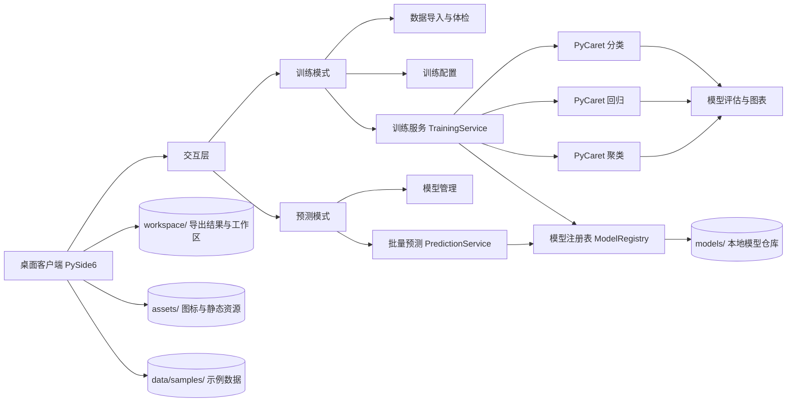

# MLquick

MLquick 是一个面向业务人员的零代码机器学习桌面产品，聚焦分类、回归、聚类三类常见分析任务，帮助用户在不写代码的前提下完成数据导入、模型训练、效果对比、批量预测和结果导出。

## 产品介绍

MLquick 的目标不是做一个面向算法工程师的实验平台，而是做一个让业务分析、运营、风控、销售支持、产品分析等角色也能直接上手的建模工具。

产品当前提供两种核心工作模式：

- 训练模式：围绕数据集导入、训练配置、模型训练、测试集预览、训练图表和模型导出展开
- 预测模式：围绕已训练模型选择、批量数据预测、结果导出和预测记录追踪展开

在交互层面，产品重点强调：

- 零代码
- 低学习成本
- 训练与预测分离
- 结果可解释、可导出、可复用

## 应用场景

### 分类场景

- 客户流失预警
- 贷款是否违约判断
- 线索是否成交预测
- 文本情感倾向识别

### 回归场景

- 销售额预测
- 房价预测
- 客户生命周期价值估计
- 工单处理时长预测

### 聚类场景

- 客户分群
- 商品分层
- 用户行为模式识别
- 业务样本结构探索

### 面向角色

- 业务分析师
- 运营经理
- 风控分析师
- 销售运营
- 产品经理

## 系统架构



## 核心能力

- 支持分类、回归、聚类三类任务
- 支持自动对比候选模型
- 支持手动指定单模型训练
- 支持训练结果子 Tab 展示
- 支持测试集完整预测预览
- 支持模型导出与结果导出
- 支持批量预测与导出记录
- 支持 CSV、XLSX、XLS 数据导入

## 当前界面结构

### 训练模式

- 左侧：训练配置区
- 右侧：数据预览、训练结果、模型详情、运行日志

训练结果页采用两层结构：

- 上层固定展示训练摘要
- 下层通过子 Tab 展示详细结果

训练结果子 Tab 当前包括：

- 模型对比
- 测试集预览
- 训练图表

其中：

- 聚类任务会自动隐藏“模型对比”
- 没有图表时会自动隐藏“训练图表”

### 预测模式

- 左侧：模型搜索、模型筛选、批量预测入口
- 右侧：预测输入预览、预测结果表、导出记录

## 文件夹树

```text
MLquick/
├─ assets/                     # 图标、logo、打包资源
├─ build/                      # PyInstaller 构建中间产物
├─ data/
│  └─ samples/                 # 示例数据集
├─ dist/                       # 打包输出
├─ docs/                       # 补充文档
├─ models/                     # 本地模型文件
├─ src/
│  ├─ __init__.py
│  ├─ mlquick_desktop.py       # 桌面端主入口
│  ├─ mlquick_core/
│  │  ├─ io_utils.py
│  │  ├─ models.py
│  │  ├─ prediction.py
│  │  ├─ profiling.py
│  │  ├─ registry.py
│  │  ├─ text.py
│  │  └─ training.py
│  └─ utils/
├─ tests/                      # 冒烟测试与桌面初始化测试
├─ workspace/                  # 导出结果与运行工作区
├─ MLquickDesktop.spec         # PyInstaller 单文件打包配置
├─ version_info.txt            # Windows 版本信息
└─ README.md
```

## 技术栈

### 桌面端

- PySide6
- Qt Widgets

### 机器学习

- PyCaret 3.3.2
- scikit-learn
- xgboost
- lightgbm

### 数据处理与可视化

- pandas
- openpyxl
- matplotlib

### 工程与打包

- uv
- PyInstaller
- unittest

## 快速开始

### 环境准备

```powershell
uv venv .venv
uv pip install -r requirements.txt
```

### 启动桌面端

```powershell
.\.venv\Scripts\python.exe src\mlquick_desktop.py
```

### 运行测试

```powershell
.\.venv\Scripts\python.exe -m unittest discover -s tests -p "test_smoke.py" -v
```

## 打包与发行

### 本地打包

当前使用 PyInstaller 进行 Windows 单文件打包：

```powershell
.\.venv\Scripts\python.exe -m PyInstaller --noconfirm --clean MLquickDesktop.spec
```

## 致谢

本项目基于以下开源生态能力构建：

- PyCaret：提供零代码/低代码机器学习工作流能力
- PySide6 / Qt：提供桌面端 GUI 能力
- scikit-learn：提供底层算法与评估能力
- pandas：提供数据处理能力
- xgboost / lightgbm：提供高性能梯度提升模型支持
- PyInstaller：提供桌面发行打包能力

感谢这些开源项目为 MLquick 的产品化提供了稳定基础。
